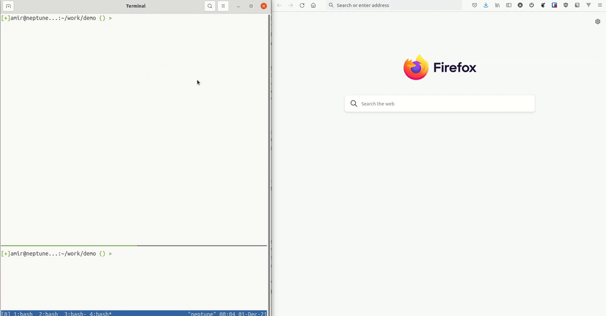

# Codex

Codex turns an unstructured pile of heterogeneous documents into a single
interactive web document.

Your input documents maybe in markdown, TeX, reStructuredText, docx, or any
other format supported by [pandoc].

[pandoc]: https://pandoc.org/

## Quick Start

Assuming you have Go and pandoc installed (tested with Go 1.17 and pandoc 2.5):

```
$ go install github.com/amirkdv/codex
$ codex A.md B.rst C.tex

Finished building from 3 docs
Starting server at address :8000
Watching 3 docs for changes ...
```

This will

* transform all your input documents to Codex's unified format,
* serve Codex on port 8000,
* watch your input files for changes and rebuild the Codex output upon changes,
* update clients every time an input changes.

## Why Codex?

I built Codex for a very specific personal use case: journaling. Here's how it
happened.

I write a lot of text. It could be drafts, todos, thoughts, ideas,
study notes, what have you. Their topic, format, and cadence varies over time
but a few things are constant:

1. **zero effort**: I don't want to integrate a whole new note-taking app in my
   life and learn all about its UI, semantics, menus, quirks and limitations.
   I'd like to write in my editor of choice (which might change over time), in
   my format of choice (which might depend on context), and store/version them
   by my tool of choice. Yet, somehow, I'd like to have a nice UI with good
   search.
1. **read vs write**: When writing, I want the least friction to focus on what
   I'm writing. When reading, I'm exploring, seeking or rummaging. I
   want to have all my notes at my disposal.
1. **inter-op**: I paste a lot of my writing in external tools that support
   markdown (e.g. GitHub) or rich-text paste (e.g. Google Docs). It'd be nice if
   I could interact with both these scenarios easily.

If this sounds similar to a problem you have, give Codex a go! You might like
it.

## An Example Workflow



My notes live in a git repo. They're mostly written in markdown and each may
have a different file structure. There are no formatting rules or special syntax
to denote anything. Just plain old documents, with headings and sections. I use
dates as the top level headings, eg `# 2021-11-30 Tue`, but Codex doesn't care
about this.

Different files are broken down by date range or topic. Some files are daily
notes, some are big "archive" files, and some task-specific like a draft of a
long document. Codex doesn't care about this either.

I always have a Codex server running in the background monitoring my notes repo
for changes; I don't pay any attention to it. Whenever I need to access my
notes, I navigate to the Codex client tab in my browser. It always has the
latest state of all my notes, in one document, with good (enough?) search.

## How does it work?

Codex has four pieces:

1. **Parse**: Codex accepts a wide range of input formats, thanks to [pandoc].
   The output of the parsing step is a single HTML tree containing all input
   documents in their original order.
2. **Transform**: this is where the core idea is implemented. Given the DOM tree
   of the previous step, Codex traverses and transforms the tree in such a way
   to make it match its own [semantic structure](#semantic-trees).
3. **Server**: the server is responsible for serving Codex output and watch its
   input files. Every time an input changes, the server triggers a rebuild and
   communicates DOM updates to its clients over WebSockets.
4. **Client**: JS code responsible for turning Codex's output HTML into a
   live app with search, folding, and full-screen.

### Semantic Trees

Consider this document:
```html
<h1> Title </h1>
<p> Paragraph </p>
<h3> Section </h3>
<p> Section paragraph </p>
<h2> Chapter </h2>
<p> Chapter paragraph </p>
```

This DOM tree is a flat list of siblings while its semantic structure is quite
different:
```html
<h1> Title </h1>                      <!--    h1        -->
                                      <!--   /  \       -->
  <p> Paragraph </p>                  <!--  p   h3      -->
  <h3> Section </h3>                  <!--     /  \     -->
    <p> Section paragraph </p>        <!--    p   h2    -->
    <h2> Chapter </h2>                <!--          \   -->
      <p> Chapter paragraph </p>      <!--           p  -->
```

Codex transforms the DOM in such a way that it matches its own semantic
structure. The building block of this is a **node**:

```html
<node depth=2>        <!-- eg <div class="node node-depth-2 ..."> ... -->
  <node-head>
    <h4> ... </h4>
  </node-head>
  <node-body>
    ...               <!-- recurse, child nodes live here -->
  </node-body>
</node>
```

**Are semantic trees well-defined?**

A DOM tree needs to follow rigid rules for this "semantic tree" to be well
defined. For example, if you wrap an `<h1>` in 5 different `<div>`s, how does the
"headness" of `<h1>` propagate up its ancestry?

Luckily, the kinds of trees that can possibly come out of a, say,
markdown or docx file, *are* indeed quite limited; written documents can only
represent trees that can be flattened into a linear order.

The main assumption that Codex makes about its input DOM tree is this:

**All headings in the document are immediate children of `<body>`**

This allows Codex to define what a document's semantic tree is, how it's related
to the DOM tree, and how to transform the DOM into its semantic structure, see
`treeify.go`.

### Releative Depths

Codex node depth calculation is file-scoped and relative to context.

**Relative to context**: it's not the heading types that dictate node depths,
but their relationship with their neighbors. For example, the following two
markdown files produce the same tree:

```md
# H1

# H1

## H2
```
```md
## H2

## H2

##### H5
```

**File-scoped**: each file is reasoned about on its own. This is consistent
with the above rule and implies no tree interference between different input
files. For example, the two example files above, if concatenated by Codex,
will produce a tree consisting of the same subtree twice, one for each of the
input files.

## To Do

* Support watching folders.
